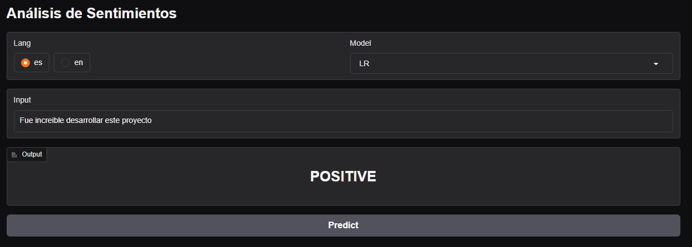
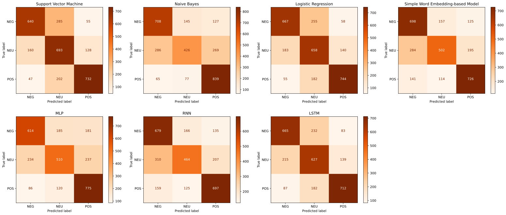
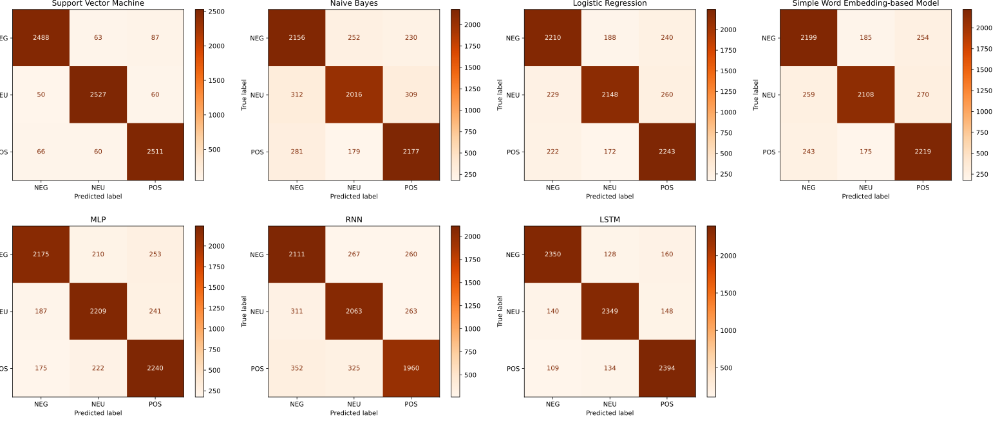

# Análisis de sentimientos

## Demo

Prueba el modelo en linea:

https://huggingface.co/spaces/duvr/sentiment_analysis



## Resultados

### Dataset de Tiktok

- Dataset propio

#### Métricas
 
| Modelo           | Accuracy   | Precision  | Recall     | F1-Score   | Tiempo (s) |
| ---------------- | ---------- | ---------- | ---------- | ---------- | ---------- |
| SVM              | 69.34%     | **70.61%** | 69.34%     | 69.57%     | 13.94      |
| NB               | 66.55%     | 66.41%     | 66.54%     | 65.25%     | 0.14       |
| LR               | **69.54%** | 70.09%     | **69.54%** | **69.70%** | 12.33      |
| SWEM (SVM + AVG) | 66.41%     | 66.17%     | 66.41%     | 66.19%     | 21.68      |
| MLP (AVG)        | 65.22%     | 65.26%     | 65.22%     | 64.98%     | 17.53      |
| RNN              | 63.22%     | 63.02%     | 63.21%     | 62.82%     | 91.40      |
| LSTM             | 67.98%     | 68.43%     | 67.98%     | 68.11%     | 125.16     |


#### Matrices de confusión



### Dataset de Twitter

- https://www.kaggle.com/datasets/jp797498e/twitter-entity-sentiment-analysis

#### Métricas

| Modelo | Accuracy   | Recall     | Precision  | F1-Score   | Tiempo (s) |
| ------ | ---------- | ---------- | ---------- | ---------- | ---------- |
| SVM    | **95.17%** | **95.17%** | **95.17%** | **95.17%** | 511.41     |
| NB     | 79.84%     | 79.84%     | 79.97%     | 79.83%     | 0.38       |
| LR     | 84.45%     | 84.45%     | 84.52%     | 84.46%     | 3.37       |
| SWEM   | 84.21%     | 84.21%     | 84.31%     | 84.23%     | 482.49     |
| MLP    | 84.29%     | 84.29%     | 84.34%     | 84.29%     | 145.76     |
| RNN    | 77.31%     | 77.31%     | 77.36%     | 77.30%     | 548.07     |
| LSTM   | 90.01%     | 90.01%     | 90.02%     | 90.01%     | 117.56     |

#### Matrices de confusión



## Pipeline

1. Tokenización (spaCy)
2. Lematización (spaCy)
3. Stemming (NLTK)
4. Vectorización (sklearn / gensim)
5. Clasificación (PyTorch / sklearn)

## Requisitos

- Python 3.11
- ffmpeg (opcional, para transcribir videos con whisper)

Este proyecto utiliza uv para la gestión de dependencias, se puede instalar facilmente con `pip`:

```bash
pip install uv
```

## Instalación

1. Clonar el respositorio

```bash
git clone https://github.com/diegourielvr/sentiment_analysis.git
cd sentiment_analysis
```

2. Instalar dependencias

```bash
uv sync
```

### Modelos NLP

Descargar los modelos necesarios para aplicar técnicas de NLP

#### spaCy

```bash
uv run python -m spacy download en_core_web_sm
uv run python -m spacy download es_core_news_sm
```


## Estructura

```bash
/sentiment_analysis/
│
├── /data/
│   ├── dictionaries/               # Diccionarios para corrección ortografica
│   └── tiktok/               
│       ├── clean/                  # Datos preprocesados (limpios y listos para el modelo)
│       ├── raw/                    # Datos intermedios (divididos en oraciones, traducidos)
│       ├── scraped/                # Datos crudos (obtenidos mediante web scraping)
│       └── transcribed/            # Datos transcritos
│
├── /notebooks/                     # EDA y entrenamiento de modelos
│   ├── train_nn.ipynb              # Entrenamiento de modelos MLP, RNN y LSTM en Google Colab
│   ├── tiktok/                     # Entrenamiento de modelos en LOCAL
│   │    ├── 01_eda_tiktok.ipynb    # Análisis exploratorio de datos (EDA)
│   │    ├── 02_SVM_tiktok.ipynb 
│   │    ├── 03_NB_tiktok.ipynb  
│   │    ├── 04_LR_tiktok.ipynb  
│   │    ├── 05_S2V_tiktok.ipynb 
│   │    ├── 06_SWEM_tiktok.ipynb 
│   │    ├── 07_MLP_tiktok.ipynb  
│   │    ├── 08_RNN_tiktok.ipynb  
│   │    └── 09_LSTM_tiktok.ipynb 
│   └── utils/                      # Fusionamiento de datos scrapeados y procesamiento de métricas
│
├── /src/                           # Código fuente del proyecto
│   ├── preprocesamiento/           # Funciones de limpieza, pln y spelling
│   ├── scraping/
│   │   └── data_collection.py      # Funciones para descargar y transcribir videos
│   ├── statistics/                 # Funciones para calcular estadísticas y graficar datos
│   └── trainers/                   # Clases para entrenar modelos
│
├── /models/                        # Modelos guardados
│   └── tiktok/
│       ├── classifiers/            # Modelos entrenados
│       └── embeddings/             # Embeddings entrenados
│
├── /results/                       # Resultados del análisis (gráficos, métricas, etc.)
│   └── tiktok/                     # Resultados de tiktok
│       ├── metrics/                # Métricas de rendimiento de los modelos
│       └── loss_curves/            # Curva de aprendizaje de los modelos
├
├── /constants/                     # Constantes utilizadas en todo el proyecto 
│
├── pyproject.toml                  # Dependencias del proyecto
└── README.md                       # Documento del proyecto
```
